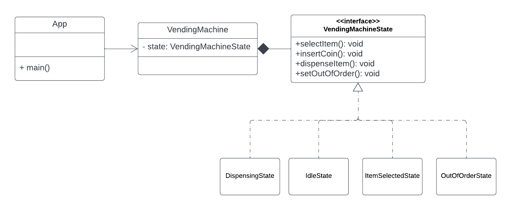

# Vending Machine State Pattern Implementation

## Problem
A vending machine needs to manage different states, including **"Idle"**, **"ItemSelected"**, **"Dispensing"**, and **"OutOfOrder"**. Each state has specific rules and restrictions regarding allowed operations, and the vending machine has associated attributes like **item inventory** and **balance**.

### Requirements

#### Idle State:
- Allow item selection.
- Disallow dispensing items and inserting coins.

#### ItemSelected State:
- Allow inserting coins and dispensing items.
- Disallow item selection.

#### Dispensing State:
- Allow no operations.
- Automatically transition back to the **"Idle"** state after dispensing is complete.

#### OutOfOrder State:
- Disallow all operations.

## Current System
The system currently relies on **conditional statements** within the `VendingMachine` class to check the machine state and determine valid actions. This approach becomes cumbersome and error-prone as the number of states and their associated logic grows.

## Solution: Implementing the State Pattern
To improve **code maintainability** and **flexibility**, we will use the **State Pattern**.

### Define Vending Machine States
Create separate classes representing different machine states:
- `IdleState`
- `ItemSelectedState`
- `DispensingState`
- `OutOfOrderState`

### Implement State Interface
Define an interface `VendingMachineState` with methods for common actions:
- `selectItem()`
- `insertCoin()`
- `dispenseItem()`
- `setOutOfOrder()`

### Implement State Behaviors
Each concrete state class implements the `VendingMachineState` interface, providing specific behavior for its respective state:
- The `IdleState` class allows **item selection**.
- The `OutOfOrderState` class **does not allow any operations**.

### Update VendingMachine Class
- Include attributes for **item inventory** and **balance**.
- Remove **state-specific logic** from the `VendingMachine` class.
- Introduce a reference to the **current `VendingMachineState` object**.
- Delegate actions (`selectItem`, `insertCoin`, `dispenseItem`, `setOutOfOrder`) to the **current state object** through its corresponding methods.
